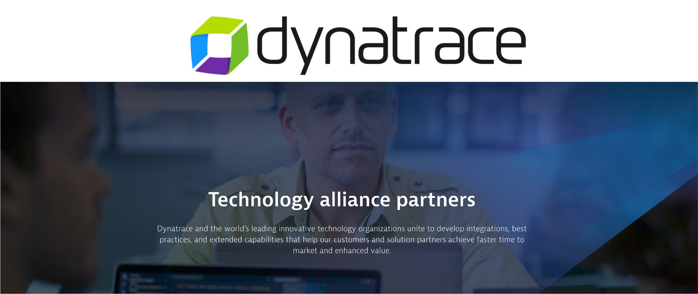

 

The repo contains the setup and learner scripts to support for [Dynatrace Alliance Partner](https://www.dynatrace.com/partners/technology-partners/) workshops.

# For more Information

Feel free to reach out with questions to Alliances Team @ alliances@dynatrace.com

# Maintainers

For technical questions or how to contribute reach out to

* [Rob Jahn](https://www.linkedin.com/in/robjahn/) -- Rob.Jahn@dynatrace.com
* [Mike Villiger](https://www.linkedin.com/in/mvilliger/) -- Michael.Villiger@dynatrace.com
* [Jay Gurbani](https://www.linkedin.com/in/jaygurbani/) -- Jay.Gurbani@dynatrace.com

